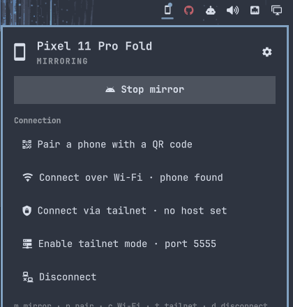
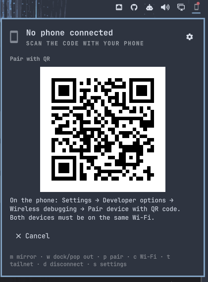

# omadroidctrl

**Your Android phone, one click from the Omarchy bar.** Pair it by scanning a QR
code, then mirror it docked under the bar or popped out into its own window.
Over Wi-Fi at home, over your tailnet anywhere else. No cables, no typing
ports, no leaving Hyprland.

> Say it *oma-droid-control*.

<!-- TODO screenshot docs/screenshots/docked.png: the phone mirror parked under the bar's right edge, panel closed -->
*Screenshot of the docked mirror coming soon.*

## Why you want this

- **Scan, don't type.** The plugin shows a QR code; your phone's *Pair device
  with QR code* does the rest. Pairing survives reboots, so it is a one-time
  thing per computer.
- **Docked or free.** The mirror lives as a borderless, always-on-top phone
  parked under the bar, or as a normal window you tile like anything else. Flip
  between the two with one key.
- **Wi-Fi and tailnet.** On your LAN the phone is found by mDNS automatically.
  Away from home, one click enables tailnet mode and the mirror follows you over
  Tailscale.
- **Themed like it belongs.** Colors, fonts and spacing come from the Omarchy
  shell, so it matches every theme you switch to.
- **Keyboard first.** `m` mirror, `w` dock or pop out, `p` pair, `c` connect,
  `s` settings. Or bind the IPC calls to Hyprland keys.


<!-- screenshot: the panel open with a connected phone: hero, Mirror/Dock row, Connection section -->

## Install

```bash
omarchy pkg add android-tools scrcpy avahi qrencode   # adb, scrcpy, mDNS, QR
omarchy plugin add https://github.com/codenamekt/omadroidctrl --enable
```

The widget appears at the right of the bar. Move it with
`omarchy bar move codenamekt.omadroidctrl --section center`.

## First pairing

1. On the phone, turn on **Developer options → Wireless debugging** and join
   the same Wi-Fi as your computer.
2. Click the phone icon in the bar, then **Pair with a QR code**.
3. On the phone tap **Pair device with QR code** and scan the panel.


<!-- screenshot: the panel showing the QR code and the three phone steps -->

The panel pairs, connects and, by default, starts mirroring right away. From
then on, **Connect over Wi-Fi** is enough whenever wireless debugging is on.

## Mirroring

| Action | Panel | Key | Bar icon |
|---|---|---|---|
| Start or stop the mirror | Mirror / Stop mirror | `m` | middle click |
| Dock under the bar or pop out | Dock / Pop out | `w` | right click |
| Open the panel | | | left click |

Docked mode floats and pins the scrcpy window under the bar at the edge you
choose in settings, keeping the phone's aspect ratio at the width you pick.
Pop out hands the window back to Hyprland as a regular tiled window. Touch,
keyboard and clipboard keep working in both modes because it is scrcpy's own
window, not a video feed.

<!-- TODO screenshot docs/screenshots/window.png: the mirror as a tiled window next to a terminal -->
*Screenshot of the popped-out window coming soon.*

## Over the tailnet

Wireless debugging announces itself with mDNS, which never crosses a tailnet.
So for remote use the plugin switches the phone to adb's fixed-port mode:

1. While connected on Wi-Fi, click **Enable tailnet mode**. The phone now
   listens on port 5555 until it reboots.
2. In settings, set **Tailnet host** to the phone's MagicDNS name or 100.x
   address.
3. Anywhere on the tailnet, **Connect via tailnet** (`t`), then mirror.

adb over TCP has no authentication of its own, so restrict port 5555 to your
own devices with a Tailscale ACL, and never expose it on the public internet.

## Settings

Open them with the gear in the panel or `s`.

| Setting | Default | What it does |
|---|---|---|
| Mirror opens as | Window | A normal window, or docked under the bar (experimental) |
| Docked position | Right | Right edge, centered, or left edge |
| Docked width | 420 px | Height follows the phone's aspect ratio |
| Max video size | 1080 | Longest side in pixels, 0 for native |
| Video bit rate | 8 Mbps | 0 uses scrcpy's default |
| Turn the phone screen off | off | Mirror with the phone display dark |
| Keep the phone awake | on | |
| Show touches | off | |
| Forward audio | on | |
| Start mirroring right after connecting | on | |
| Extra scrcpy arguments | | Anything scrcpy accepts, e.g. `--crop=1080:1920:0:0` |
| Tailnet host / port | / 5555 | Target for Connect via tailnet |
| Refresh interval | 30 s | Bar icon state polling while the panel is closed |
| Wi-Fi discovery timeout | 15 s | How long Connect over Wi-Fi waits for mDNS |
| QR pairing timeout | 120 s | How long the QR code stays valid |

## Troubleshooting

Everything the plugin does is logged in two places:

```bash
tail -f ~/.local/state/omadroidctrl/helper.log        # every adb, avahi, scrcpy and hyprctl step
journalctl --user -f | grep omadroidctrl              # what the panel asked for and got back
omadroidctrl-helper log 60                            # last 60 helper lines as JSON
```

Common causes:

- **Nothing happens after scanning.** Android only advertises wireless
  debugging while the phone is awake and the feature is on. Keep the phone
  unlocked on the Wireless debugging screen until the panel says connected.
  The helper log shows every mDNS service it saw.
- **"No phone found on Wi-Fi".** Same cause, or the network blocks mDNS
  (guest and many corporate Wi-Fi networks do). Pairing and Wi-Fi connect need
  multicast; use tailnet mode instead.
- **Mirror starts then closes.** Read `~/.local/state/omadroidctrl/scrcpy.log`;
  the helper copies its last lines into the panel error as well.

## Hyprland keybinds

Every action is available over the shell's IPC, so you can bind it:

```bash
omarchy-shell codenamekt.omadroidctrl toggleMirror
omarchy-shell codenamekt.omadroidctrl toggleWindow
omarchy-shell codenamekt.omadroidctrl pair
omarchy-shell codenamekt.omadroidctrl connect        # Wi-Fi
omarchy-shell codenamekt.omadroidctrl connectTailnet
omarchy-shell codenamekt.omadroidctrl disconnect
omarchy-shell codenamekt.omadroidctrl toggle         # the panel
```

## How it works

- `omadroidctrl-helper` is a small bash script that owns every shell command:
  `adb`, `scrcpy`, `avahi-browse` for mDNS, `qrencode`, and `hyprctl` for
  docking. It speaks JSON to the QML side, one event per line for the long
  pairing and connect flows.
- The QR payload is `WIFI:T:ADB;S:<name>;P:<code>;;`. Your phone reads it,
  starts a pairing server, and advertises `_adb-tls-pairing._tcp`. The helper
  finds that service, runs `adb pair`, then finds `_adb-tls-connect._tcp` and
  runs `adb connect`.
- The Arch `android-tools` build of adb ships without mDNS, which is why
  discovery goes through Avahi rather than `adb mdns`.
- Docking is plain Hyprland: `setfloating`, `pin`, `resizewindowpixel`,
  `movewindowpixel` on the window titled `omadroidctrl`, placed just below the
  bar's reserved area on the focused monitor.

## Requirements

- Omarchy Quattro with shell plugins
- Android 11 or newer (wireless debugging)
- `android-tools`, `scrcpy`, `avahi`, `qrencode`, `jq`

## Tests

```bash
tests/manifest-test.sh   # the checks omarchy plugin validate enforces
tests/helper-test.sh     # the helper against stubbed adb, scrcpy, avahi, qrencode, hyprctl
tests/source-test.sh     # contracts between Panel.qml, Service.qml and the helper
```

## License

MIT. See [LICENSE](LICENSE).
